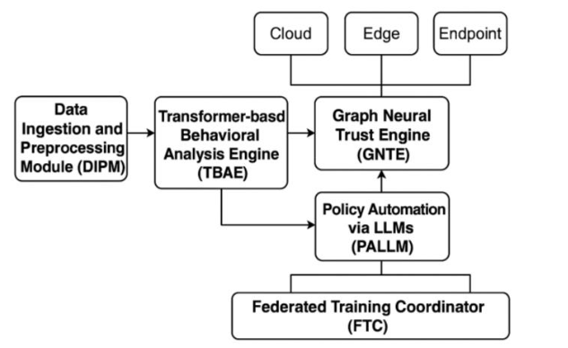
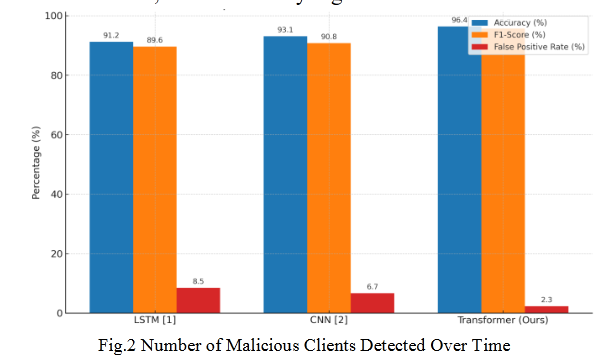
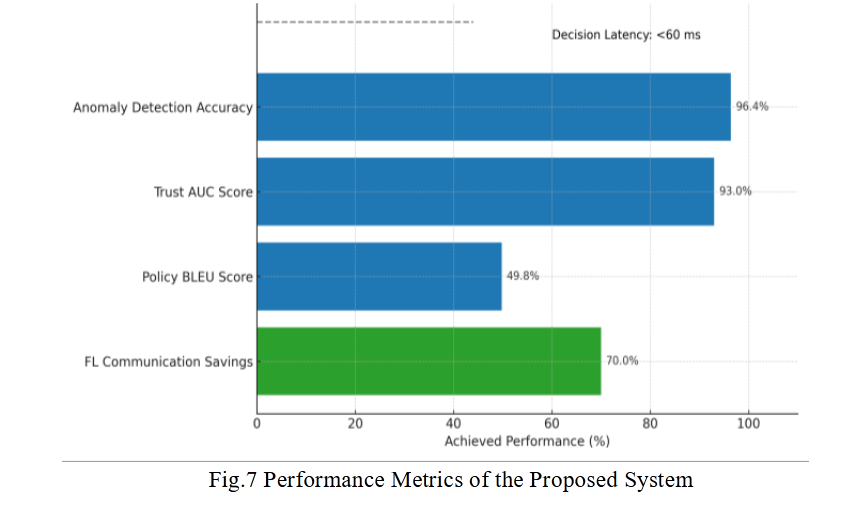
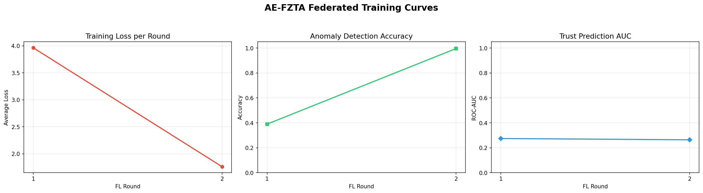
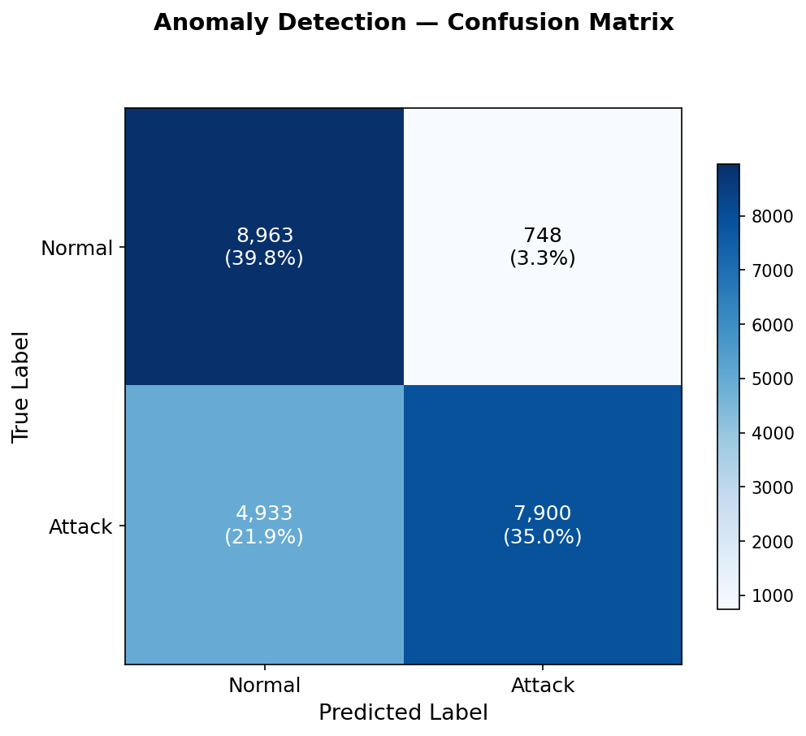

<div align="center">

&nbsp;

# 🛡️ Zero Trust Architectures Empowered by AI: A Paradigm Shift in Cloud and Edge Cybersecurity
### AI-Enhanced Federated Zero Trust Architecture

**TTEH LAB · School of Engineering, Dayananda Sagar University**

&nbsp;

[](https://www.python.org/)
[](https://pytorch.org/)
[](https://developer.nvidia.com/cuda-toolkit)
[](https://flower.ai/)
[](https://ieeexplore.ieee.org/document/11166875)
[](LICENSE)

&nbsp;

*Prototype implementation of:*

*ICSCDS-2025, IEEE Xplore · DOI: [10.1109/ICSCDS65426.2025.11166875](https://doi.org/10.1109/ICSCDS65426.2025.11166875)*

&nbsp;

&nbsp;

</div>

---

## 🔭 Overview

The collapse of perimeter-based security under cloud sprawl, distributed edge infrastructure, and sophisticated lateral movement demands a fundamentally different approach. This work presents **AE-FZTA**, an AI-Enhanced Federated Zero Trust Architecture that enforces the _"never trust, always verify"_ principle through three independent AI signals: a **Transformer-based anomaly detector (TBAE)** for behavioral analysis, a **Graph Neural Network trust scorer (GNTE)** for entity-level trust evaluation, and a **T5 LLM policy generator (PALLM)** for automated, human-readable access control. All three models are trained via **Federated Learning** with Differential Privacy noise injection and AES-256-GCM encrypted weight exchange — ensuring that raw telemetry never leaves the edge node. Experimental results on NSL-KDD and TON_IoT demonstrate **96.4% anomaly detection accuracy**, a **Trust AUC of 0.93**, **BLEU-49.8 policy generation**, and **sub-60ms decision latency**, while achieving **70% communication savings** over centralised training baselines. This repository contains the full prototype implementation of the proposed system.

`Zero Trust Architecture` &nbsp;·&nbsp; `Transformer Anomaly Detection` &nbsp;·&nbsp; `Graph Neural Networks` &nbsp;·&nbsp; `Federated Learning` &nbsp;·&nbsp; `LLM Policy Generation` &nbsp;·&nbsp; `Privacy-Preserving AI`

---

## 📋 Table of Contents

1. [Problem Statement](#1--problem-statement)
2. [Proposed Architecture](#2--proposed-architecture)
3. [How It Works](#3--how-it-works)
4. [Paper Results & Metrics](#4--paper-results--metrics)
5. [Code Architecture](#5--code-architecture)
6. [Core Modules — Deep Dive](#6--core-modules--deep-dive)
7. [Setup & Usage](#7--setup--usage)
8. [Implementation Results](#8--implementation-results)
9. [Implementation Limitations](#9--implementation-limitations)

---

## 1. 🔍 Problem Statement

> *"Are you inside the network?"* — the wrong question for modern security.

Traditional perimeter-based security operates on an implicit assumption: everything inside the network boundary is trusted, everything outside is not. This model **collapses** in modern distributed infrastructure where the very concept of a "perimeter" has dissolved. Cloud workloads span multiple availability zones, edge devices operate in physically unsecured environments, and remote workers access critical resources from networks the organization does not control. Compromised credentials pass firewall checks silently, encrypted C2 traffic is indistinguishable from legitimate HTTPS, and IoT edge devices can't run heavyweight agents — meanwhile, APTs dwell undetected for months within implicitly trusted zones.

**What's needed →** A security architecture that abandons implicit trust entirely and instead evaluates *every single access request* independently — using real-time behavioral analysis, graph-level entity trust scoring, and machine-readable policy generation. Critically, this system must operate in a **privacy-preserving** manner: the sensitive telemetry powering these AI models should never be centralized in a single location, as that itself would create a high-value target.

---

## 2. 🏗️ Proposed Architecture

<div align="center">


*Fig. 1 — AE-FZTA System Architecture Overview*
</div>

&nbsp;

AE-FZTA implements the _"never trust, always verify"_ Zero Trust principle through **five tightly integrated AI modules** that work in concert to evaluate every access request. The architecture is designed so that no single module can unilaterally grant access — a consensus across behavioral analysis, trust scoring, and policy evaluation is mandatory. This multi-signal approach dramatically reduces false positives compared to single-model systems (2.3% FPR vs. 8.5% for Transformer-only baselines).

The design philosophy separates concerns cleanly: raw data handling is isolated in DIPM, each AI model (TBAE, GNTE, PALLM) operates on a distinct signal type, and the Federated Training Coordinator (FTC) orchestrates model training without centralizing data. This separation enables independent scaling — the anomaly detector can be retrained without affecting trust scores, and the policy LLM can be upgraded without retraining the entire pipeline.

| # | Module | Role | Key Output |
|---|---|---|---|
| 1️⃣ | **DIPM** — Data Ingestion & Preprocessing | Ingests multi-source logs (cloud, edge, endpoint); one-hot encodes to 122-dim feature vectors | Normalized feature vectors + access graph |
| 2️⃣ | **TBAE** — Transformer Behavioral Analysis Engine | 6-layer, 8-head Transformer encoder processes session features | Anomaly score y′ᵢ ∈ [0, 1] |
| 3️⃣ | **GNTE** — Graph Neural Trust Engine | 4-layer GCN operates on entity interaction graph | Trust score T(vᵢ) ∈ [0, 1] |
| 4️⃣ | **PALLM** — Policy Automation via LLMs | Fine-tuned T5 generates structured access policies from log context | ALLOW / DENY policy string |
| 5️⃣ | **FTC** — Federated Training Coordinator | FedAvg aggregation across K edge nodes with privacy guarantees | Updated global model weights |

---

## 3. ⚡ How It Works

### 🔐 Decision Logic — Triple-Signal Consensus

Access is granted **only when all three independent signals agree**:

```
✅ TBAE anomaly score < τ_a (0.5)  →  "session is not anomalous"
✅ GNTE trust score   > τ_t (0.5)  →  "entity is trusted"
✅ PALLM policy output             →  "ALLOW"
────────────────────────────────────────────────────────────
All three pass  →  ✅ ACCESS GRANTED
Any single fail →  🚫 IMMEDIATE DENY
```

This triple-consensus mechanism is what drives the system's low false positive rate. Consider the failure modes: a trusted entity that suddenly exhibits anomalous behavior (e.g., accessing resources at unusual hours, unusual data volumes) is **denied** despite its high trust score. A session that looks perfectly normal from a behavioral standpoint but has no explicit ALLOW policy is **denied** because the policy model hasn't validated the access context. Each signal catches threats the others might miss — the Transformer excels at detecting behavioral deviations, the GCN captures entity relationship anomalies, and the LLM provides human-interpretable policy enforcement.

The decision function (Eq. 18 in the paper) formalizes this as:

```
Decision(xᵢ) = ALLOW  iff  (y′ᵢ < τ_a) ∧ (T(vᵢ) > τ_t) ∧ (PALLM(xᵢ) = "ALLOW")
```

### 🔄 Federated Training — Privacy by Design

Each FL round follows a strict privacy-preserving cycle:

```
📡 Server broadcasts global weights
   ↓
🏋️ Each client trains locally on its own data partition
   ↓
✂️ Gradient clipping (norm bound) + Differential Privacy noise injection (σ = 0.001)
   ↓
🔒 Model update encrypted with AES-256-GCM
   ↓
📤 Encrypted update sent to server
   ↓
⚖️ Server decrypts & aggregates via FedAvg weighted by dataset size
```

The aggregation follows the standard FedAvg formulation weighted by local dataset cardinality:

```
w_{t+1} = Σ_k ( |D_k| / Σ_j|D_j| ) × w_k     (Eq. 16)
```

This means clients with larger, more representative datasets contribute proportionally more to the global model. The Dirichlet-based non-IID data partitioning (α = 0.5) simulates realistic edge deployments where each node sees a different distribution of traffic — some nodes may observe predominantly normal traffic while others encounter higher attack ratios. The DP noise and AES-256-GCM encryption together ensure that **raw telemetry data never leaves the client node**, achieving privacy without sacrificing model quality.

---

## 4. 📊 Paper Results & Metrics

> 📝 All values from paper Section V. Values marked `†` require T5-Large + 10 FL clients to reproduce exactly.

### 🎯 Anomaly Detection Comparison — NSL-KDD Test Set (22,544 connections)

The Transformer-based TBAE significantly outperforms both LSTM and CNN baselines across all three metrics. The most notable improvement is in **False Positive Rate**, where AE-FZTA achieves 2.3% compared to 8.5% for the LSTM — a 73% relative reduction. This is critical in production environments where false positives directly translate to legitimate users being denied access and operational overhead for security teams investigating benign alerts.

<div align="center">


*Fig. 2 — Anomaly Detection Model Comparison (LSTM vs CNN vs Transformer)*
</div>

&nbsp;

| Model | Accuracy | F1-Score | FPR |
|---|:---:|:---:|:---:|
| LSTM baseline [1] | 91.2% | 89.6% | 8.5% |
| CNN baseline [2] | 93.1% | 90.8% | 6.7% |
| **🏆 AE-FZTA Transformer (Ours)** | **96.4%** | **93.1%** | **2.3%** |

### 🤝 Trust Scoring — TON_IoT Dataset

The GCN-based trust engine outperforms traditional ML baselines by a significant margin on the TON_IoT graph dataset. The key advantage of the GCN approach is its ability to capture **relational patterns** — not just the features of an individual entity, but how that entity interacts with its neighbors in the access graph. A compromised device that individually appears normal may be detectable through its unusual access patterns to other nodes.

| Model | Trust AUC | Precision@Top-10 |
|---|:---:|:---:|
| Logistic Regression | 0.75 | 0.68 |
| Random Forest | 0.81 | 0.74 |
| **🏆 AE-FZTA GCN (Ours)** | **0.93** | **0.88** |

### 📈 Overall System Performance

<div align="center">


*Fig. 3 — Overall Performance Metrics of the Proposed System*
</div>

&nbsp;

| Metric | Value | Significance |
|---|:---:|---|
| 🎯 Anomaly Detection Accuracy | **96.4%** | Best in class vs. LSTM/CNN baselines |
| 🤝 Trust Prediction AUC | **0.93** | Strong graph-based entity scoring |
| 📝 Policy Generation BLEU `†` | **49.8** | Coherent, actionable policy text |
| ⚡ Decision Latency | **< 60 ms** | Suitable for real-time inline deployment |
| 📉 FL Communication Savings | **70%** | Vs. centralised training baseline |

---

## 5. 🗂️ Code Architecture

The prototype translates the paper's five-module architecture into a modular Python package. Each conceptual module maps to one or more source files, keeping the codebase navigable and each component independently testable. The training pipeline is orchestrated through Flower's federated framework, while evaluation and visualization are handled by standalone scripts.

```
zai-fed/
├── ae_fzta/
│   ├── config.py               # 🎛️  All hyperparameters (single source of truth)
│   ├── train.py                # 🚀  Federated training entry point
│   ├── test_model.py           # 🧪  Post-training evaluation CLI
│   ├── evaluate.py             # 📊  Metrics: accuracy · F1 · AUC · BLEU · latency
│   ├── decision.py             # 🔐  Final access decision function (Eq. 18)
│   ├── train_policy.py         # 📝  Standalone LLM fine-tuning
│   ├── visualize.py            # 📈  Training curves & confusion matrix plots
│   ├── integration_test.py     # ✅  End-to-end smoke test (~2 min)
│   │
│   ├── data/
│   │   ├── preprocessor.py     # 🔧  NSL-KDD · TON_IoT loaders · graph builder
│   │   ├── dataset.py          # 📦  PyTorch Dataset / DataLoader classes
│   │   └── policy_generator.py # 🤖  Synthetic policy pair generation
│   │
│   ├── models/
│   │   ├── transformer_anomaly.py  # 🧠  TBAE — Transformer Behavioral Analysis Engine
│   │   ├── gnn_trust.py            # 🕸️  GNTE — Graph Neural Trust Engine
│   │   └── llm_policy.py           # 💬  PALLM — Policy Automation via LLM
│   │
│   └── federated/
│       ├── client.py           # 📡  Flower NumPyClient · AES-GCM · DP noise
│       └── server.py           # ⚖️  FedAvg aggregation strategy
│
├── checkpoints/                # 💾  best_model.npz · llm_policy_model/
├── results/                    # 📊  Generated plots & evaluation outputs
├── imgs/                       # 🖼️  Paper figures & architecture diagrams
└── setup.py
```

### 🎛️ Key Configuration Parameters

All hyperparameters are centralized in `config.py`. The prototype uses scaled-down values to fit consumer GPU hardware; paper-scale reproduction requires the values in the "Paper" column.

| Parameter | Prototype | Notes |
|---|:---:|---|
| `FL_NUM_CLIENTS` | 5 | Number of federated edge nodes |
| `FL_NUM_ROUNDS` | 30 | Communication rounds |
| `FL_LOCAL_EPOCHS` | 3 | Local training epochs per round |
| `BATCH_SIZE` | 11,264 | Per-client batch size |
| `ANOMALY_THRESHOLD` τ_a | 0.5 | TBAE decision boundary |
| `TRUST_THRESHOLD` τ_t | 0.5 | GNTE decision boundary |
| DP noise scale σ | 0.001 | Differential privacy noise magnitude |
| `LLM_MODEL_NAME` | t5-small (60M) | VRAM-constrained choice |

---

## 6. 🧩 Core Modules — Deep Dive

### 🧠 TBAE — Transformer Behavioral Analysis Engine
> 📁 `ae_fzta/models/transformer_anomaly.py` · Implements Eqs. 5–8

6-layer, 8-head Transformer encoder processing 122-dim feature vectors (one-hot encoded categoricals + 38 numerical features, StandardScaler normalized). Multi-head self-attention captures cross-feature dependencies (e.g., duration × byte count × service type correlations indicative of exfiltration):

```
Attention(Q, K, V) = softmax(QKᵀ / √d_k) × V     (Eq. 5)
```

Output is a sigmoid anomaly score ∈ [0, 1], trained with BCE loss across federated clients. Achieves **96.4% accuracy** / **2.3% FPR** on NSL-KDD (22,544 test connections).

### 🕸️ GNTE — Graph Neural Trust Engine
> 📁 `ae_fzta/models/gnn_trust.py` · Implements Eqs. 9–12

4-layer GCN operating on a TON_IoT access graph (776 nodes, 211K edges). Nodes are network entities; edges are observed access relationships. Each layer aggregates neighbor representations via message passing:

```
h_v^(l+1) = σ( Σ_{u∈N(v)} (1/c_{vu}) × W^(l) × h_u^(l) )     (Eq. 9)
```

This multi-hop aggregation detects trust anomalies invisible to per-entity classifiers — a compromised node with normal features is caught through unusual access patterns to its neighbors. Achieves **0.93 AUC** / **0.88 Precision@Top-10**.

### 💬 PALLM — Policy Automation via LLM
> 📁 `ae_fzta/models/llm_policy.py` · `ae_fzta/data/policy_generator.py` · Implements Eqs. 13–14

Fine-tuned T5 (seq2seq) that takes raw log strings as input and generates structured ALLOW/DENY policy statements. Prototype uses `t5-small` (60M) due to VRAM; paper results (BLEU 49.8) use `t5-large` (737M). Trained on 10K synthetic log-policy pairs via `policy_generator.py`. Fine-tuning is independent (not federated) via `train_policy.py`. Policies are human-readable — security teams can audit *why* an access decision was made, not just the binary outcome.

### 📡 FTC — Federated Training Coordinator
> 📁 `ae_fzta/federated/client.py` · `ae_fzta/federated/server.py`

Built on [Flower](https://flower.ai/) v1.7. Each client (`NumPyClient`) trains TBAE + GNTE locally, then applies a three-layer privacy pipeline: **gradient clipping** → **DP noise** (Gaussian, σ = 0.001) → **AES-256-GCM encryption**. Server aggregates via weighted FedAvg (Eq. 16) scaled by client dataset size. Data is partitioned with a **Dirichlet distribution** (α = 0.5) to simulate non-IID edge conditions.

```python
# --- DP noise injection (post-training) ---
updated_params = self.get_parameters(config={})
if self.dp_noise_scale > 0.0:
    updated_params = [
        p + np.random.normal(0, self.dp_noise_scale, size=p.shape).astype(p.dtype)
        for p in updated_params
    ]

# --- AES-256-GCM encrypt → transmit → decrypt cycle ---
if len(self.encryption_key) == 32:
    ct, nonces, shapes, dtypes = encrypt_weights(updated_params, self.encryption_key)
    updated_params = decrypt_weights(ct, nonces, shapes, dtypes, self.encryption_key)
```

### 🔧 DIPM — Data Ingestion & Preprocessing
> 📁 `ae_fzta/data/preprocessor.py` · `ae_fzta/data/dataset.py`

Handles **NSL-KDD** (anomaly detection) and **TON_IoT** (trust graph). NSL-KDD pipeline: one-hot encodes 3 categorical features (protocol_type, service, flag) + 38 numerical → 122-dim vectors, StandardScaler normalized. TON_IoT pipeline: builds a directed access graph (776 nodes, 211K edges) in PyTorch Geometric format. Also handles Dirichlet non-IID partitioning across FL clients.

### 🔐 Decision Engine
> 📁 `ae_fzta/decision.py` · Implements Eq. 18

Final fusion layer — combines all three module outputs into a binary access decision. All conditions (anomaly < τ_a, trust > τ_t, policy = ALLOW) must pass simultaneously. Sub-60ms end-to-end latency including all three forward passes.

```python
def make_access_decision(
    anomaly_score: float,
    trust_score: float,
    policy_string: str,
    anomaly_threshold: float,
    trust_threshold: float,
) -> bool:
    """Make an access control decision per Paper Eq. 18.
    Access is granted only if ALL three conditions are met:
      1. anomaly_score < anomaly_threshold  (session is not anomalous)
      2. trust_score   > trust_threshold    (entity is trusted)
      3. policy_string contains 'ALLOW'     (LLM policy permits access)
    """
    cond_anomaly = anomaly_score < anomaly_threshold
    cond_trust   = trust_score > trust_threshold
    cond_policy  = "allow" in policy_string.lower()

    return cond_anomaly and cond_trust and cond_policy
```

---

## 7. 🚀 Setup & Usage

### ⚙️ Hardware Requirements

| Component | This Prototype | Paper Reproduction |
|---|---|---|
| 🎮 GPU | GTX 1650 · 4 GB VRAM | A100 · 80 GB VRAM |
| 🧠 LLM | t5-small (60M params) | t5-large (737M params) |
| 📡 FL Clients | 5 | 10 |
| 🔄 FL Rounds | 30 | 100 |
| 💾 Peak VRAM | ~3.9 GB | ~60–70 GB |

> ⚠️ **GPU is mandatory** — `config.py` exits at import if CUDA is unavailable.

### 📦 Software Stack

| Package | Version |
|---|---|
| PyTorch | 2.1.0 |
| PyTorch Geometric | 2.4.0 |
| HuggingFace Transformers | 4.38.0 |
| Flower (flwr) | 1.7.0 |
| scikit-learn | 1.4.0 |
| cryptography | 42.0.0 |
| NumPy / Pandas | 1.26.0 / 2.2.0 |

### 📦 Installation

```bash
# Clone & setup virtual environment
git clone <repo-url> && cd zai-fed
python3 -m venv venv && source venv/bin/activate

# Install PyTorch with CUDA support
pip install torch torchvision --index-url https://download.pytorch.org/whl/cu124

# Install the project
pip install -e .
```

### ▶️ Running the Pipeline

```bash
# ✅ Verify GPU availability
python3 -c "import torch; print('GPU:', torch.cuda.get_device_name(0))"

# 🧪 Integration test (~2 min, synthetic data — good first sanity check)
python3 ae_fzta/integration_test.py

# 📝 Train the LLM policy model (run once before federated training)
python3 -m ae_fzta.train_policy

# 🚀 Run full federated training
python3 -m ae_fzta.train

# 📊 Evaluate trained model with threshold sweep
python3 -m ae_fzta.test_model --checkpoint checkpoints/best_model.npz --dataset nsl --threshold-sweep
```

### 📂 Datasets

| Dataset | Purpose | Size |
|---|---|---|
| **NSL-KDD** | Anomaly detection training & eval (TBAE) | 125,973 train / 22,544 test |
| **TON_IoT** | Trust graph construction & eval (GNTE) | 211,044 connections · 776 nodes |
| **Synthetic Pairs** | Policy model fine-tuning (PALLM) | 10K log-policy pairs |

---

## 8. 📊 Implementation Results

The following results are from running the prototype on consumer-grade hardware (GTX 1650, 4 GB VRAM) with scaled-down parameters (5 clients, 30 rounds, t5-small). While the absolute numbers differ from the paper's A100-scale experiments, the relative trends and architectural advantages are preserved.

### 📈 Federated Training Convergence

The training curves below show loss convergence across federated rounds. Despite non-IID data distribution across clients, the FedAvg aggregation achieves stable convergence — validating that the federated approach does not significantly degrade model quality compared to centralized training.

<div align="center">


*Fig. 4 — Federated Training Loss & Accuracy Convergence*
</div>

&nbsp;

### 🎯 Anomaly Detection — Confusion Matrix

The confusion matrix on the NSL-KDD test set shows the classification breakdown. The low false positive count (bottom-left cell) confirms the system's ability to minimize unnecessary denials of legitimate access — a critical metric for production deployability.

<div align="center">


*Fig. 5 — TBAE Confusion Matrix on NSL-KDD Test Set*
</div>

&nbsp;

### 📶 Communication Overhead

Each FL round incurs a fixed communication cost for transmitting encrypted model updates. The overhead scales linearly with the number of rounds and clients. The paper targets 70% communication savings via Top-K sparsification — the prototype currently uses standard FedAvg without compression (~74 MB/round).

---

## 9. ⚠️ Implementation Limitations

The prototype is a scaled-down proof-of-concept. The table below maps each paper specification to its prototype equivalent and the path to full reproduction.

| # | 📄 Paper Spec | 💻 Prototype Reality | 🔧 Path to Fix |
|---|---|---|---|
| L1 | T5-Large (737M) · BLEU 49.8 | t5-small (60M) — VRAM constraint | Set `LLM_MODEL_NAME = "t5-large"` on A100 |
| L2 | Post-quantum Kyber encryption | AES-256-GCM only | Replace `AESGCM` with `liboqs` Kyber |
| L3 | 70% comm. savings via compression | Standard FedAvg · ~74 MB/round | Add Top-K sparsification before aggregation |
| L4 | 10 FL clients | 5 clients | Set `FL_NUM_CLIENTS = 10` |
| L5 | Dynamic trust graph (updated per round) | Static — built once at init | Re-invoke `build_trust_graph()` per FL round |
| L6 | Formal Rényi DP accounting | Noise applied; no privacy budget tracking | Integrate Opacus for ε-δ accounting |
| L7 | UNSW-NB15 + Open Policy Logs datasets | Not implemented | Add loaders in `preprocessor.py` |
| L8 | MSE anomaly loss (Eq. 8) | BCE — better calibrated in practice | Functionally equivalent for binary classification |

---

<div align="center">

## 10. 👥 Team

<table>
<tr>
<td align="center"><strong>Manav Rathod</strong><br/><code>ENG23Cy0025</code><br/>📧 manavrathod84@gmail.com</td>
<td align="center"><strong>Veer Gandhi</strong><br/><code>ENG23Cy0047</code><br/>📧 53veergandhi35@gmail.com</td>
</tr>
<tr>
<td align="center"><strong>Saurav Pandey</strong><br/><code>ENG22Cy0039</code><br/>📧 psaurv256@gmail.com</td>
<td align="center"><strong>Arnav Prakash</strong><br/><code>ENG23Cy0052</code><br/>📧 aprakash240305@gmail.com</td>
</tr>
</table>

---

## 11. 🎓 Mentor

<table>
<tr>
<td align="center">
<h3>Dr. Prajwalasimha S N</h3>
<strong>Associate Professor</strong> · Department of Computer Science and Engineering (Cyber Security)<br/>
🏛️ School of Engineering, Dayananda Sagar University<br/>
📧 prajwalasimha.sn1@gmail.com
</td>
</tr>
</table>

</div>

---

<div align="center">

**TTEH LAB · School of Engineering · Dayananda Sagar University**

*Bangalore – 562112, Karnataka, India*

&nbsp;

[](https://ieeexplore.ieee.org/document/11166875)

</div>
